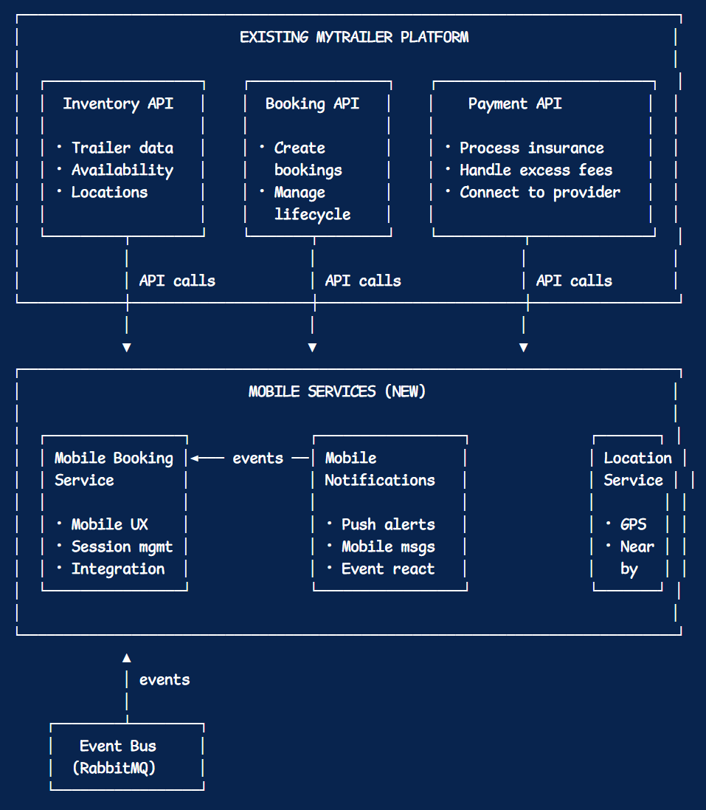
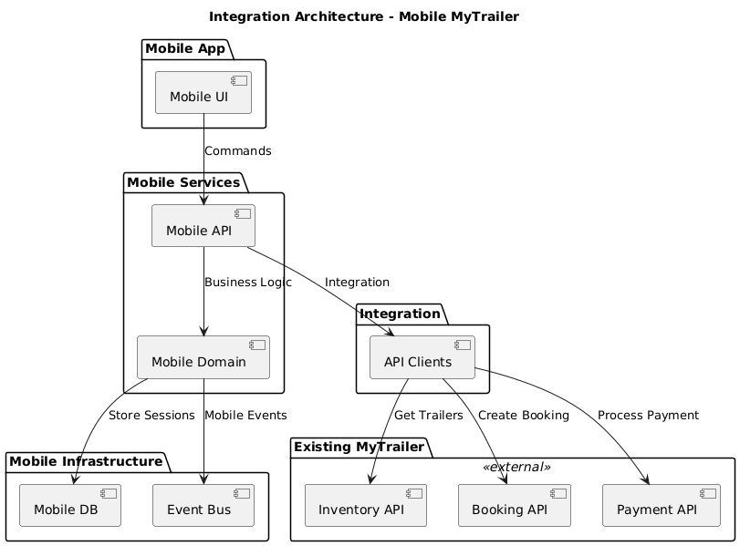
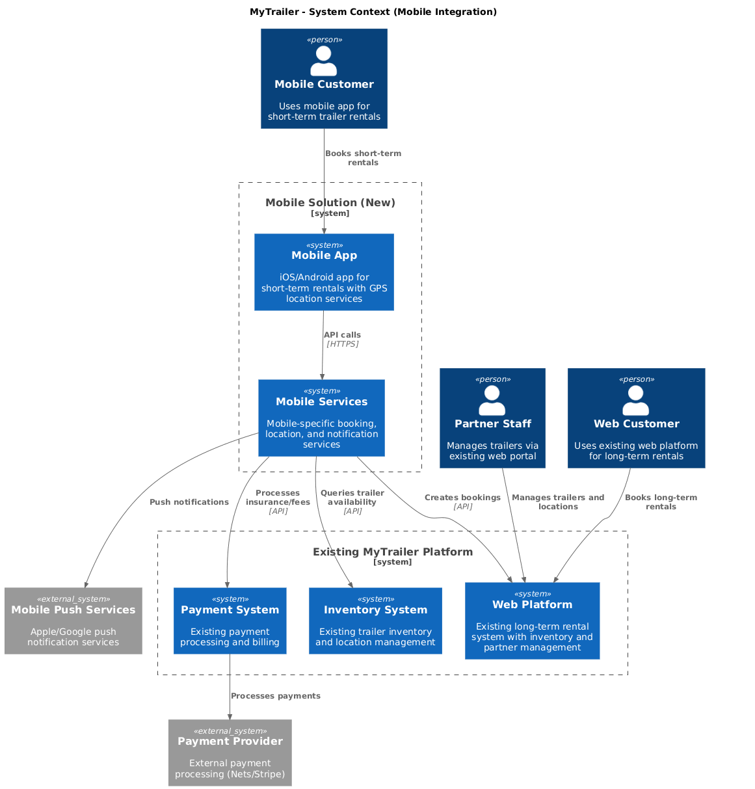
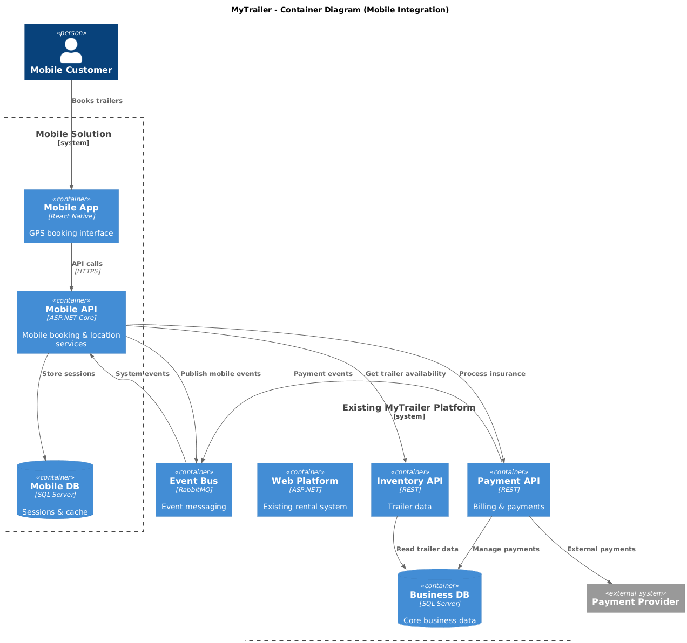
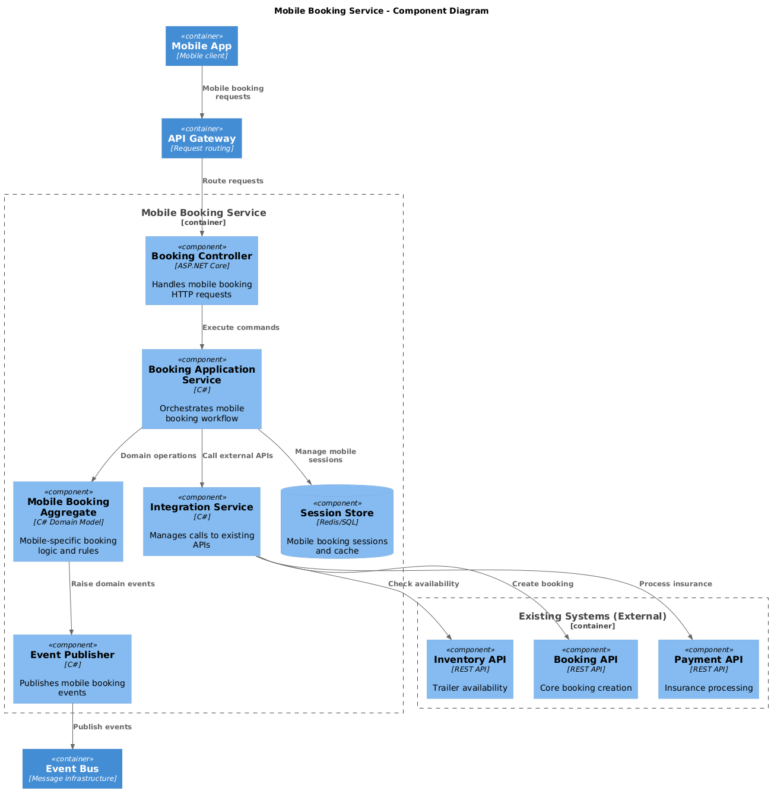

# MyTrailer OLA3 modelling

This document contains the OLA3 DDD model for MyTrailer short-term mobile booking flow. It is the foundation for OLA4 which will be done in parallel, and is not a coding project; but a planning using DDD and C4.

# Contents 

- [1. Key Understandings](#1-key-understandings)
- [2. Ubiquitous Language](#2-ubiquitous-language)
- [3. Event Storming](#3-event-storming)
- [4. Bounded Contexts (Subsystems)](#4-bounded-contexts-subsystems)
    - [4.1. Context Map](#41-context-map)
- [5. Aggregates & Entities (Tactical DDD Approach)](#5-aggregates--entities--tactical-ddd-approach)
    - [5.1. Messaging & Layer Interaction](#51-messaging--layer-interaction)
    - [5.2. Layered Architecture](#52-layered-architecture)
    - [5.3. Domain Events](#53-domain-events)
- [6. C4 Model (System Context)](#6-c4-model-system-context)
- [7. Definition of Done](#7-definition-of-done)
- [8. Notes on Implementation for OLA4](#8-notes-on-implementation-for-ola4)

---

# 1. Key understandings

We start with getting some bullet-point understandings of the domain; such as boundaries, actors and rules **at a glance**. This is not exhaustive but captures the main points to inform the model. It serves as a form of outline-expectation if you will.

1. Domain: Short-term trailer rental
2. Users: Customers, Partner companies, MyTrailer admins
3. Business Rules: 
    - Bookings max 24h, end by midnight
    - Optional insurance (50 Kr)
    - Late return penalty (ExcessFee)
    - No double-booking
    - Payment handling with success/failure flows

 `! Revenue model: insurance and excess fees`

 
4. System Constraints:
    - Mobile app integrates with existing MyTrailer web platform
    - Existing trailer inventory and partner management systems
    - External payment provider (integrated via existing web system)
    - Event-driven integration for mobile-specific notifications and billing
    - Trailers are identified by Location + TrailerNumber (existing schema)
5. Goal: Model mobile service integration, event-driven architecture and DDD patterns for mobile-specific bounded contexts

| What are aggregates? |
| --- |
| Aggregates are a cluster of domain objects that can be treated as a single unit. In the context of DDD, an aggregate is a boundary around a group of related entities and value objects that are always consistent with each other. The aggregate root is the main entity that controls access to the other entities within the aggregate. | 
| - Copilot |

# 2. Ubiquitous Language

The best approach to understanding our objective is by understanding and ensuring we share the same language and terminology. 
We define the terms that apply to **OUR** domain. 

> Note for example how a "Booking" is a short term rental in our context, whereas the web based solution may see it as a long term rental that goes beyond midnight. Thats why we need to be clear on our terms and why ubiquitous language is important.

| Term          | Definition                                                                |
| ------------- | ------------------------------------------------------------------------- |
| Trailer       | A physical trailer available for rent.                                    |
| Booking       | A short-term rental of a trailer.                                         |
| Customer      | User of the mobile app who rents trailers.                                |
| Partner Store | Location where trailers are parked; may pay for advertising.              |
| LocationID    | Unique identifier for a trailer location.                                 |
| TrailerNumber | Number identifying a specific trailer at a location.                      |
| Insurance     | Optional insurance purchased by customer.                                 |
| ExcessFee     | Penalty fee for late return.                                              |
| Payment       | Process to charge customer for insurance/excess fees.                     |
| Notification  | Messages sent to customer or partner (booking confirmed, reminder, etc.). ***(?) Inferred - not explicitly in requirements but typical for booking systems** |

# 3. Event Storming
We will do some event storming which is slightly more technical, but still high-level. This will help us identify key domain events, commands, and policies that drive the system. It also helps us identify aggregates and their boundaries or at least peer into their workings and interactions. This layer is good to have as it solidifies the aggregates. In being able to map out events and 'feeling' like we have most events fleshed out; we become more confident that we have the correct actors of our domain.

### Domain Events (Mobile-Specific)

| **Event**              | **Triggered by**       | **Notes**                                      |
|------------------------|------------------------|------------------------------------------------|
| MobileBookingCreated   | Mobile App User        | When a mobile booking is successfully created via integration |
| LocationQueried        | Mobile App User        | When user searches for nearby trailers (analytics) |
| MobileBookingCancelled | Mobile App User        | Mobile-specific cancellation with push notifications |
| MobileInsurancePurchased| Mobile App User       | Insurance purchase through mobile-optimized flow |
| MobileSessionStarted   | Mobile App User        | When user starts mobile booking session |

### External Events (Subscribed From Existing Systems)

| **Event**              | **Source System**      | **Mobile Response**                           |
|------------------------|------------------------|-----------------------------------------------|
| TrailerStatusChanged   | Existing Inventory     | Update mobile app availability display        |
| BookingConfirmed       | Existing Booking API   | Send mobile push notification                 |
| PaymentProcessed       | Existing Payment       | Update mobile app payment status              |
| TrailerReturnedLate    | Existing Booking       | Mobile-specific late return notification      |

### Commands (Mobile-Specific)

| **Command**         | **Initiator** | **Target Service**           | **Integration**              |
|---------------------|---------------|------------------------------|------------------------------|
| FindNearbyTrailers  | Mobile User   | Location Service            | Queries existing Inventory API |
| CreateMobileBooking | Mobile User   | Mobile Booking Service      | Integrates with existing Booking API |
| CancelMobileBooking | Mobile User   | Mobile Booking Service      | Calls existing Booking API + mobile events |
| PurchaseMobileInsurance| Mobile User | Mobile Payment Service      | Routes through existing Payment API |
| StartMobileSession  | Mobile User   | Mobile Session Service      | New mobile-specific capability |
| SendPushNotification| System        | Mobile Notification Service | New mobile-specific capability |

 

# 4. Bounded Contexts (subsystems)

These contexts represent the **mobile-specific services** that integrate with existing MyTrailer systems. We focus on mobile user experience and short-term rental workflows while leveraging existing business capabilities through APIs and event messaging.

| Context             | Responsibilities                      | Integration Notes                                                    |
| ------------------- | ------------------------------------- | -------------------------------------------------------------------- |
| Mobile Booking      | Mobile-specific booking workflow      | Integrates with existing trailer inventory API and booking validation |
| Mobile Payment      | Insurance/excess fees for mobile users| Integrates with existing payment provider through web system API     |
| Location Services   | GPS-based trailer discovery           | **New service** - uses existing trailer location data via API        |
| Mobile Notifications| Push notifications for mobile app     | **New service** - receives events from existing and new systems      |
| Integration Layer   | API gateway and event translation     | **New service** - bridges mobile services with existing systems      |

# 4.1 Context Map:

The context map illustrates the integration architecture between mobile services and existing MyTrailer systems. Mobile services act as **customers** of existing APIs (Customer/Supplier pattern), while sharing event communication through a common event bus (Shared Kernel pattern). This approach allows mobile development independence while leveraging proven existing capabilities for trailer inventory, core booking logic, and payment processing.

# 5. Aggregates & Entities  (Tactical DDD approach)

## Tactical DDD Flow

Here's how mobile actions flow through the system and integrate with existing services:

| Action                | Mobile Service         | Integration Point     | Domain Event Published | Event Subscribers       |
|---------------------- |-----------------------|----------------------|-----------------------|------------------------|
| Find Nearby Trailers  | LocationService       | Existing Inventory API| LocationQueried       | None (query operation)  |
| Create Booking        | MobileBookingService  | Existing Booking API  | MobileBookingCreated  | Payment, Notification  |
| Return Trailer Late   | MobileBookingService  | Existing Booking API  | TrailerReturnedLate   | Payment, Notification  |
| Buy Insurance         | MobilePaymentService  | Existing Payment API  | MobileInsurancePurchased | Existing Payment System |
| Cancel Booking        | MobileBookingService  | Existing Booking API  | MobileBookingCancelled   | Payment, Notification  |

## Mobile Booking Aggregate (New)

- **Aggregate Root:** MobileBooking
- **Entities:** BookingSession, Location
- **Value Objects:** BookingTime, GPS Coordinates, MobileDeviceID
- **Domain Events:** MobileBookingCreated, MobileBookingCancelled, LocationQueried
- **Integration:** Validates against existing trailer inventory, creates bookings via existing booking API

## Existing System Integration Points

- **Trailer Inventory:** Read-only access via existing API (LocationID, TrailerNumber, Status)
- **Customer Management:** Integrates with existing customer system via API
- **Payment Processing:** Routes through existing payment infrastructure  
- **Partner Management:** Read-only access to existing partner and location data

## Mobile-Specific Aggregates Only

We focus on mobile-specific domain logic while treating existing systems as external bounded contexts accessed through well-defined APIs and event contracts.

More about aggregates in [Tactical Design](./tactical-design.md)

# 5.1. Integration & Event-Driven Communication

The mobile system integrates with existing MyTrailer systems through APIs and event messaging. Mobile services handle mobile-specific concerns while delegating core business operations to existing proven systems.

**Integration Pattern:**
1. Mobile app calls Mobile Services for mobile-specific operations (GPS search, session management)
2. Mobile Services call existing system APIs for core operations (booking creation, inventory queries, payment processing)
3. Mobile Services publish mobile-specific events for mobile-only concerns (push notifications, analytics)
4. Mobile Services subscribe to existing system events to react to business changes

**Event Bus Integration:** Mobile services connect to existing event infrastructure to participate in the broader system event flow while maintaining mobile-specific event handling.

# 5.2. Integration Architecture

**Simple Integration Flow:**
1. **Mobile App** → Sends requests to Mobile Services
2. **Mobile Services** → Handle mobile-specific logic + call existing APIs  
3. **Integration Layer** → API clients that talk to existing MyTrailer systems
4. **Existing Systems** → Inventory, Booking, and Payment APIs (unchanged)
5. **Mobile Infrastructure** → Stores mobile sessions and publishes mobile events

**Key Principle:** Mobile services add mobile capabilities while existing systems handle core business logic. Integration happens through well-defined API calls.

# 5.3. Mobile-Specific Domain Events

Mobile services publish events that complement the existing system event flow:

**Mobile-Originated Events:**
- **MobileBookingCreated** — Published by Mobile Booking Service, triggers mobile-specific payment and notification flows
- **LocationQueried** — Published when user searches for nearby trailers, for analytics and recommendations
- **MobileInsurancePurchased** — Mobile-specific insurance purchase flow
- **MobileBookingCancelled** — Mobile cancellation with mobile-specific notification requirements

**Existing System Events (Subscribed):**
- **TrailerStatusChanged** — From existing inventory system, updates mobile app availability
- **PaymentProcessed** — From existing payment system, triggers mobile notifications
- **BookingConfirmed** — From existing booking system, triggers mobile-specific confirmation flow

**Integration Benefit:** Mobile services can react to existing system changes while contributing mobile-specific behavior without disrupting existing web platform operations.

# 6. C4 Model (System Context)

The System Context diagram illustrates the integration boundaries between the new mobile solution and existing MyTrailer infrastructure. Customers access short-term rentals through the new mobile app, while the existing web portal continues serving long-term rentals and partner management. The mobile system integrates with existing payment processing, inventory management, and partner systems rather than replacing them.

## 6.1. Container Diagram

The Container diagram shows the integration architecture between new mobile services and existing MyTrailer systems. The mobile app connects to focused mobile services (booking, location, notifications) which integrate with existing web-based infrastructure through APIs and event messaging. This allows rapid mobile feature development while preserving existing business operations and leveraging proven system capabilities.

## 6.2. Component Diagram (Booking Service)

The Component diagram zooms into the Mobile Booking Service to show how it integrates with existing systems while handling mobile-specific logic. The API layer handles mobile requests, the Application layer orchestrates integration with existing booking and inventory APIs, the Domain layer contains mobile-specific business rules (GPS, short-term constraints), and the Infrastructure layer manages integration with existing databases and message buses.

# 7. Definition of Done

- All domain events identified. ✅
- Commands mapped to aggregates. ✅
- Bounded contexts identified and mapped. ✅
- Aggregates, entities, and value objects defined. ✅
- Ubiquitous language documented. ✅
- C4 diagrams (system, container, component) included. ✅
- Documentation explains requirements understanding and decisions. ✅
- Model ready for experimentation / OLA4. ✅

## 8. Notes on Implementation for OLA4

**System Integration Focus:**
- Develop mobile services that integrate with existing MyTrailer web platform
- Leverage existing trailer inventory, customer management, and payment systems via APIs
- Add mobile-specific capabilities (GPS location, push notifications, mobile UX) without duplicating existing functionality
- Event-driven integration to participate in existing business workflows

**Mobile-Specific Development:**
- Location-based trailer discovery and booking optimization for mobile users
- Mobile-optimized payment flows for insurance and excess fees (integrating with existing payment provider)
- Real-time push notifications complementing existing email/SMS systems
- Mobile session management and offline capability considerations

**Integration Architecture:**
- API Gateway pattern for mobile services to existing system integration  
- Event sourcing for mobile-specific events while subscribing to existing system events
- Database integration strategy: mobile service databases + API calls to existing systems
- Authentication integration with existing customer identity system
- Monitoring and logging integration with existing operational infrastructure