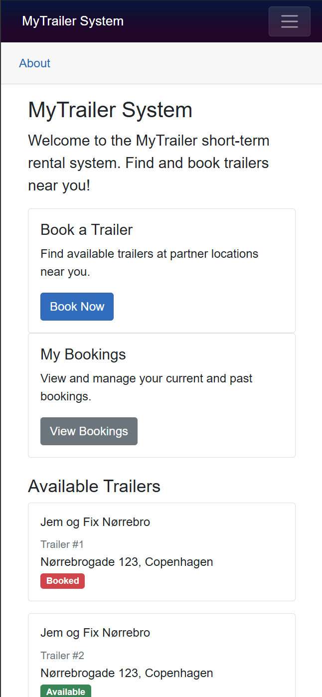
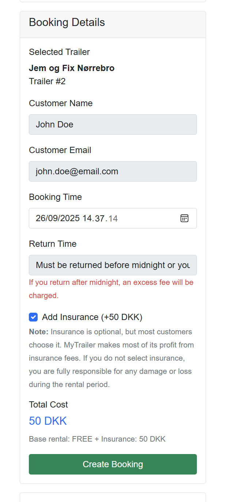
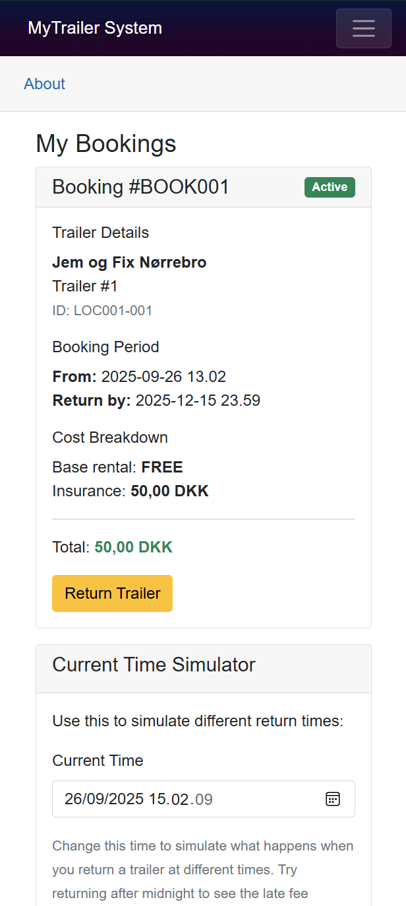
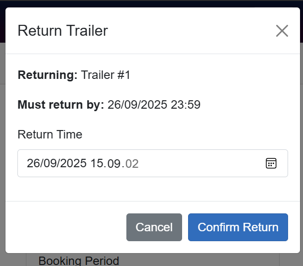
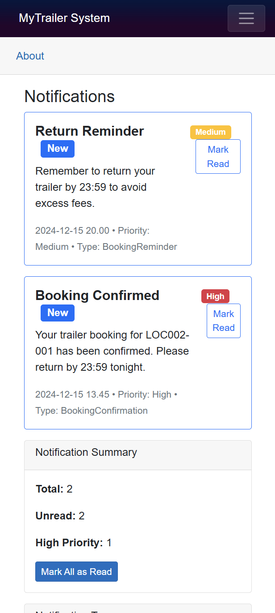

# MyTrailer System - OLA4 Implementation

This is the implementation for OLA4, demonstrating a Domain-Driven Design (DDD) approach to building a trailer rental system using C# Blazor Server. Our Documentation here is an extension of OLA-3 and is built upon the DDD analysis we designed. In other words, the program is runnable, but not a proper product, most of it is mocked, but the design lets the OLA-3 qualities peer through and we will go over this promptly.
First; some technical documentation:

## System Overview

The MyTrailer System is a short-term trailer rental platform that allows customers to book trailers located at partner stores (like Jem og Fix or Fog which were used in this mock) for up to 24 hours, with mandatory return by midnight.

## Architecture

### Domain-Driven Design Implementation

The system follows DDD principles with clear bounded contexts:

#### Bounded Contexts
- **Mobile Booking Service**: Handles trailer booking lifecycle
- **Trailer Inventory Service**: Manages trailer availability and status
- **Notification Service**: Manages customer notifications
- **Integration Layer**: Coordinates between services

### Ports and Adapters Pattern

The application implements the Ports and Adapters (Hexagonal Architecture) pattern:

```
┌────────────────────────────┐
│            Web UI (Blazor)         │
│     (Primary Adapter)              │
├────────────────────────────┤
│          Application Services      │
│    - BookingService                │
│    - TrailerService                │
│    - NotificationService           │
├────────────────────────────┤
│         Domain Models              │
│    - Booking (Aggregate Root)      │
│    - Trailer                       │
│    - Notification                  │
├────────────────────────────┤
│       Infrastructure               │
│    JSON File Storage               │
│    (Secondary Adapter)             │
└────────────────────────────┘
```

### Key Domain Rules Implemented

1. **24-Hour Maximum Rental**: Bookings cannot exceed 24 hours
2. **Midnight Return Deadline**: All trailers must be returned by 23:59 (otherwise late fees apply and you are directed to the main website)
3. **Late Return Penalties**: Determined by website and outside of the our domain
4. **Optional Insurance**: 50 DKK insurance fee
5. **No Double Booking**: Trailers can only be booked when available

## Technology Stack

- **Framework**: ASP.NET Core 8 with Blazor Server
- **Language**: C#
- **Data Storage**: JSON files (mocking external existing systems)
- **UI**: Bootstrapped blazor pages
- **Architecture**: Domain-Driven Design with Ports and Adapters

## Project Structure

```
MyTrailerSystem/
├── Components/
│   ├── Layout/          # Layout components (NavMenu, etc.)
│   └── Pages/           # Blazor pages
├── Models/              # Domain models and DTOs
├── Services/            # Domain services (bounded contexts)
├── Data/                # Mock JSON data files
│   ├── trailers.json    # Trailer inventory
│   ├── bookings.json    # Booking records
│   └── notifications.json # Customer notifications
└── Program.cs           # Application configuration
```

## Mock Data Integration

The system uses JSON files to simulate integration with existing systems:

- **trailers.json**: Simulates existing trailer inventory API
- **bookings.json**: Simulates existing booking system
- **notifications.json**: Simulates notification service

This demonstrates how the mobile services would integrate with existing MyTrailer infrastructure through APIs.

# The fun stuff:
## Key Business Logic: Booking/Return flow

let us look at the user flow as documented in OLA-3 demonstrated here in our application:

### 1. Home Page

First we demonstrate the home page where trailers are listed with their availability status. Users can navigate to book a trailer. It isnt the prettiest implementation, but it is a POC and highly mocked.

<div style="display: flex; flex-wrap: wrap; align-items: center; gap: 2rem; min-height: 320px;">
  
  <ul style="flex: 1; min-width: 250px; list-style: disc inside; margin: 0; padding-left: 1rem; align-self: center;">
    <li style="margin-bottom: 1.5em;"><strong>Double-Booking Prevention:</strong> The UI disables booking for trailers already marked as <span style="background:#dc3545;color:white;padding:2px 8px;border-radius:4px;">Booked</span>, demonstrating the domain rule that only available trailers can be reserved and no double booking allowed.</li>
    <li style="margin-bottom: 1.5em;"><strong>Location Context:</strong> Trailers are shown with their partner store and address, supporting the integration with external inventory systems as described in OLA-3.</li>
    <ul style="list-style: circle inside; margin: 0 0 1.5em 2em; padding-left: 1.5em;">
      <li><strong>Trailers are to identified by trailer number and location:</strong> <span style="background:#28a745;color:white;padding:2px 8px;border-radius:4px;">Enforced.</span></li>
    </ul>
    <li style="margin-bottom: 1.5em;"><strong>Clear Separation of Concerns:</strong> The home page demonstrates DDD by separating trailer inventory, booking actions, and user navigation, reflecting the bounded contexts from OLA-3 as well.</li>
  </ul>
</div>

### 2. Booking Page

Following the flow into an available trailer and trying to book it, we see the booking page:

<div style="display: flex; flex-wrap: wrap; align-items: center; gap: 2rem; min-height: 320px;">
  
  <ul style="flex: 1; min-width: 250px; list-style: disc inside; margin: 0; padding-left: 1rem; align-self: center;">
<h2>The mocking side of things</h2>
<p>  The booking page relies on mocked data from the `trailers.json` file to simulate real booking scenarios. This allows for testing various booking flows without needing a live backend and allows us to demonstrate the intent. In a real business scenario, it would not be unheard of to go these lengths of demonstrating the vision before dabbling in the real implementation.


Furthermore we have mocked booking time (this would normally be automatically populated based on current time) which helps us simulate different booking timings effectively.</p>
<h3>Key Domain Rules</h3>
    <li style="margin-bottom: 1.5em;"><strong>24-Hour Rental Limit:</strong> The booking form enforces a maximum rental duration of 24 hours, with validation to prevent exceeding this limit, demonstrating the domain rule.</li>
    <li style="margin-bottom: 1.5em;"><strong>Midnight Return Enforcement:</strong> The return time picker restricts selections to before midnight of the booking day, ensuring compliance with the return deadline rule.</li>
    <li style="margin-bottom: 1.5em;"><strong>Optional Insurance:</strong> The insurance checkbox allows users to opt-in for insurance at a fixed fee, reflecting the business rule for optional insurance (the main source of profit).</li>
  </ul>
</div>


### 3. My Bookings Page

After a booking and recieving the green light to use the trailer, we can move on to the post-use scenario of wanting to return the trailer. This is done through the "My Bookings" page:

<div style="display: flex; flex-wrap: wrap; align-items: center; gap: 2rem; min-height: 320px;">
  
  <ul style="flex: 1; min-width: 250px; list-style: disc inside; margin: 0; padding-left: 1rem; align-self: center;">
  <h2>Mocked elements</h2>
<p>The "My Bookings" page uses mocked booking data from the `bookings.json` file to simulate user bookings. This allows us to demonstrate the return process and late fee calculations without a live backend. The current time simulator is also a mocked feature that helps test late return scenarios effectively.

Upon setting the time to be before midnight we get a successful return process. Going beyond midnight triggers the late fee calculation. This part has not been mock-implemented fully as we found ourselves wanting to let go of the OLA and move straight into planning for the exam, but our intent was to show a success case in the case of returning before midnight, and otherwise we would show a mildly displeased modal that informs the user to contact the customer support (with a reference to the website) as per the OLA-3 "guidelines."</p>


<p>aside from this mocked return modal, the "My Bookings" page demonstrates several key domain rules and DDD principles we employed during OLA-3:</p>
    <li style="margin-bottom: 1.5em;"><strong>Booking Management:</strong> Users can view their active bookings with details such as trailer number, location, booking time, and return time.</li>
    <li style="margin-bottom: 1.5em;"><strong>Return Process:</strong> The "Return Trailer" button initiates the return process, updating the trailer status and notifying the user of the return status.</li>
    <li style="margin-bottom: 1.5em;"><strong>Late Fee Calculation:</strong> If the current time exceeds the booked return time (simulated via the "Current Time Simulator"), the user would be referred to the customer support.</li>
    <li style="margin-bottom: 1.5em;"><strong>Notification Integration:</strong> Upon returning the trailer, whether successful or not, the notification service informs the user of the return status and any applicable fees.</li>
    <li style="margin-bottom: 1.5em;"><strong>Current Time Simulator:</strong> This feature allows users to simulate different current times to test late return scenarios, enhancing testing capabilities without altering system time.</li>
  </ul>
</div>

### 4. The Notification system

The notification system is a crucial part of the MyTrailer System, ensuring users are informed about their bookings and any important updates. In the OLA-3 we werent sure we wanted this in as it was not part of the obligatory requirements. Through domain-driven research on similar apps and what we deemed "common practice", we found that most bookings apps of pretty much any time would send out a notification regarding statusses, extended latencies etc. We therefore decided to implement a basic notification system that would send out notifications for key events such as booking confirmations and late return alerts. This not only enhances the user experience but also demonstrates cross-context communication as outlined in our DDD design and is an individual bounded context in itself.

<div style="display: flex; flex-wrap: wrap; align-items: center; gap: 2rem; min-height: 320px;">
  
  <ul style="flex: 1; min-width: 250px; list-style: disc inside; margin: 0; padding-left: 1rem; align-self: center;">
    <li style="margin-bottom: 1.5em;"><strong>Business Rule Enforcement:</strong> Users receive clear, prioritized alerts for booking confirmations and return reminders, enforcing rules like timely returns and booking confirmations.</li>
    <li style="margin-bottom: 1.5em;"><strong>Cross-Context Communication:</strong> Notifications are triggered by domain events from other services, demonstrating DDD integration and service collaboration.</li>
  </ul>
  <p>Much like the trailer service on the home page that provide trailer inventory statusses, and the booking service that provides booking management, the notification service is an individual bounded context in itself, with its own domain model and business logic. Let us dive deeper into the service integration pattern</p>
</div>

## Service Integration
Each service follows the same pattern:
1. **Interface Definition**: Clear contract for the bounded context
2. **Implementation**: Business logic with proper error handling
3. **Data Access**: JSON file manipulation (simulating database/API)
4. **Event Publishing**: Notifications for cross-context communication

## How to Run (if you had wanted to. It is highly mocked though and not very functional)

1. Navigate to the MyTrailerSystem directory
2. Run `dotnet restore` to restore packages
3. Run `dotnet build` to build the application
4. Run `dotnet run` to start the application
5. Navigate to `http://localhost:5000` in your browser

---
<div style="display: flex; flex-wrap: wrap; gap: 2rem; align-items: flex-start; margin-bottom: 2rem;">
  <div style="flex: 1; min-width: 220px;">
    <h3>Domain Events</h3>
    <ul style="list-style: disc inside; margin: 0; padding-left: 1rem;">
      <li><strong>MobileBookingCreated:</strong> When a new booking is made</li>
      <li><strong>TrailerReturned:</strong> When a trailer is returned</li>
      <li><strong>LateFeeApplied:</strong> When a late return incurs website reference</li>
      <li><strong>NotificationSent:</strong> When notifications are created</li>
    </ul>
  </div>
  <div style="flex: 1; min-width: 220px;">
    <h3>Integration Points</h3>
    <ul style="list-style: disc inside; margin: 0; padding-left: 1rem;">
      <li><strong>Trailer Inventory:</strong> Read trailer availability and locations</li>
      <li><strong>Customer Management:</strong> Access to customer information</li>
      <li><strong>Payment Processing:</strong> Handle insurance and excess fees</li>
      <li><strong>Notification Service:</strong> Send booking confirmations and reminders</li>
    </ul>
  </div>
  <div style="flex: 1; min-width: 220px;">
    <h3>Scalability Considerations</h3>
    <ul style="list-style: disc inside; margin: 0; padding-left: 1rem;">
      <li><strong>Database systems:</strong> SQL Server, PostgreSQL</li>
      <li><strong>Message brokers:</strong> RabbitMQ, Apache Kafka</li>
      <li><strong>External APIs:</strong> Existing MyTrailer services</li>
      <li><strong>Event sourcing:</strong> For audit trails</li>
    </ul>
  </div>
</div>

## Conclusion

Through domain driven design principles, we essentially were able to understand the inner workings of what we were building. Knowing what the business considered primary income and what the business rules were, made it easier to implement the system in a way that reflected the business needs.

In a way DDD resembles a lesson we recently had in SI where we talked about Business Process Modelling, this implements similar principles, although without a strict notation and without needing to supersede a legacy system. The ubiquitous language part (which we admittedly did not separate per context as well as we could have) helped us translate terms into entities, and separate conceptual workers from physical ones.

Overall we feel like we better understand how understanding the domain helps build a system. It almost feels like something that should ALWAYS be done (unless the scale is very small and the domain is very simple).
